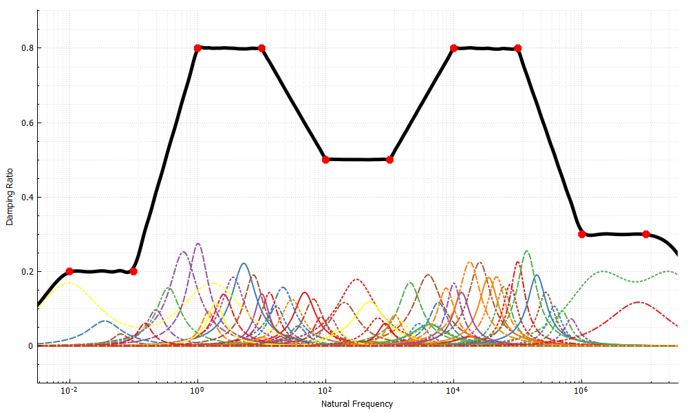

# Damping Dolphin

---

🐬 Damping Dolphin is a utility to visualise and generate parameter sets for use in the damping model.

It is able to generate desired model parameters that fit the target damping response on the frequency domain.

Please check the following references on the background theory of the proposed damping model.

1. [10.1016/j.compstruc.2020.106423](https://doi.org/10.1016/j.compstruc.2020.106423)
2. [10.1016/j.compstruc.2021.106663](https://doi.org/10.1016/j.compstruc.2021.106663)

## To Compile

### Prerequisites

Please install [Qt 5.12 LTS](https://doc.qt.io/qt-5.12/index.html). [OpenBLAS](https://github.com/xianyi/OpenBLAS) is
used as the linear algebra driver. The bundled build (under `lib/`) may not be optimal on your machine, replace it with
your version if necessary.

#### Linux

Nothing needs to be noted.

#### Windows

[Qt 5.12 LTS](https://doc.qt.io/qt-5.12/index.html) works with `GCC 8.1.0`. If it is not installed, you can either use
the distribution by [WinLibs](https://winlibs.com/) (recommended)
or [MinGW-w64](https://sourceforge.net/projects/mingw-w64/files/).

Alternatively, download and install [Visual Studio 2019](https://visualstudio.microsoft.com/vs/older-downloads/) if you
wish to use MSVC platform.

## Dependencies

The dark theme is taken from [TeXstudio](https://github.com/texstudio-org/texstudio) project.

1. [Qt](https://doc.qt.io/qt-5.12/index.html)
2. [Armadillo](http://arma.sourceforge.net/docs.html)
3. [ensmallen](https://ensmallen.org/)
4. [OpenBLAS](https://github.com/xianyi/OpenBLAS)
5. [QCustomPlot](https://www.qcustomplot.com/)
6. [tbb](https://github.com/oneapi-src/oneTBB)
